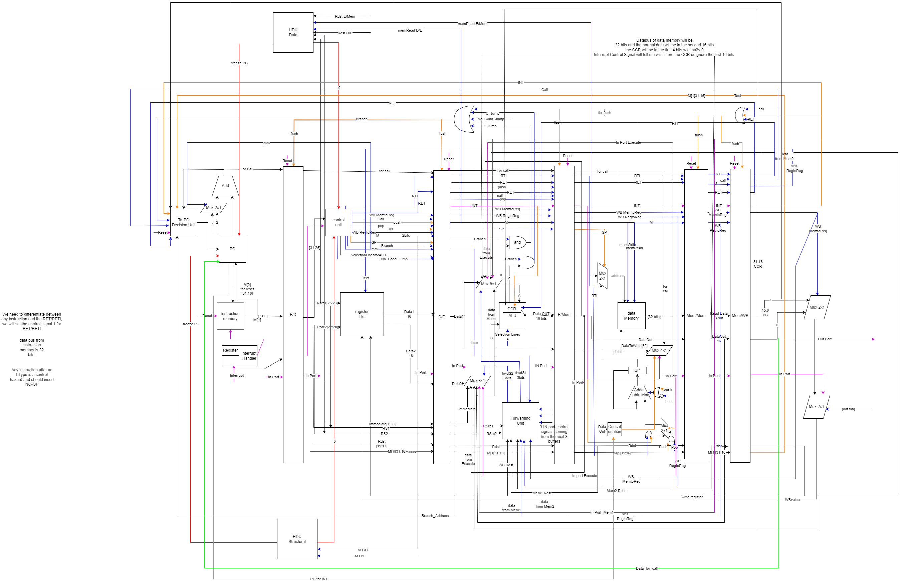

# 6-stage pipelined processor, Harvard.
## Overview
The processor in this project has a RISC-like instruction set architecture. 
* There are eight 2-byte general purpose registers; R0, till R7. 
* Another two general purpose registers, One works as a  program counter (PC). And the other, works as a stack pointer (SP); and hence; points to the top of the stack. 

The initial value of SP is (2^10-2). The data memory address space is 1 KB of 16-bit width and is word addressable. ( N.B. word = 2 bytes).

The data memory in our processor is slow, so we split the memory stage into two stages and the new pipeline should be Fetch, Decode, Execute, Memory1,Memory2, writeback.

### The processor supports multiple units:
* Control Unit
* Hazard detection Unit (Structural and data)
* Forward unit
* PC decision unit

Below, you can find the PDF for the design, providing a clearer view, in addition to the design of signals and instructions.

[Design PDF Preview](./Design.pdf)

[Download Design PDF](./Design.pdf)
 
[Signals and Instruction Design PDF Preview](./ControlSignals_multiplexers_units.pdf)

[Download Signals and Instruction PDF](./ControlSignals_multiplexers_units.pdf)

